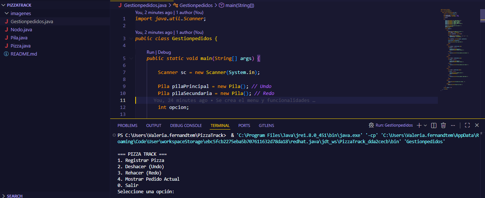
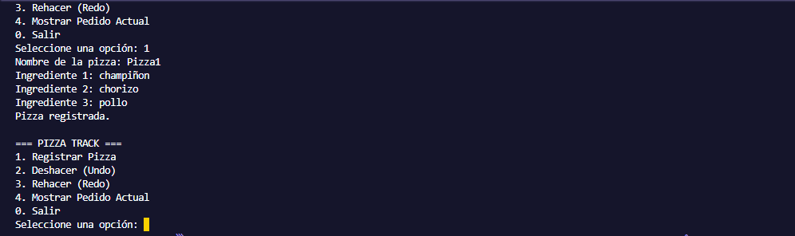
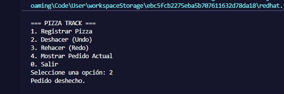
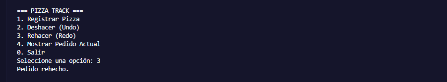
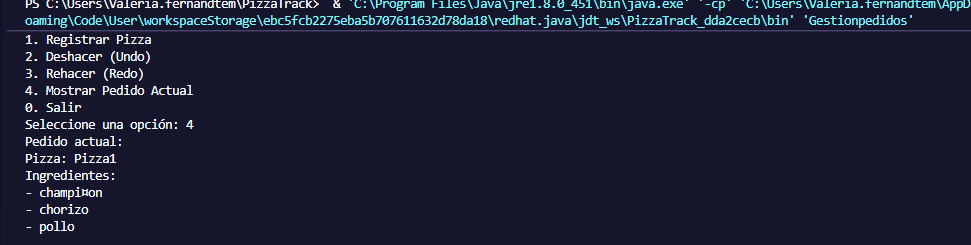

# 🍕 PizzaTrack - Sistema de Gestión de Pedidos con Pilas

## 📌 Descripción del Proyecto

PizzaTrack es una aplicación desarrollada en **Java** que simula el sistema de gestión de pedidos de una pizzería utilizando la estructura de datos **Pila (Stack)** implementada manualmente mediante **listas ligadas**.

El sistema permite registrar pedidos de pizza y gestionar acciones de **Deshacer (Undo)** y **Rehacer (Redo)** utilizando dos pilas:

* **Pila Principal (Undo):** almacena los pedidos activos.
* **Pila Secundaria (Redo):** almacena temporalmente los pedidos deshechos para poder recuperarlos.

La aplicación se ejecuta en **consola** y permite al usuario interactuar mediante un menú de opciones.

---

# 🎯 Objetivo

Comprender y aplicar el concepto de **pila** mediante la implementación manual de una estructura basada en **listas ligadas**, desarrollando un sistema de registro de pedidos de pizza con funcionalidades de **Undo y Redo**.

---

# ⚙️ Tecnologías Utilizadas

* **Java**
* **VS Code**
* **JDK Eclipse Temurin**
* **Git**
* **GitHub**

---

# 🧱 Estructura del Proyecto

El proyecto está compuesto por las siguientes clases:

```
PizzaTrack
│
├── Pizza.java
├── Nodo.java
├── Pila.java
└── GestionPedidos.java
```

### 📄 Descripción de las clases

**Pizza.java**

Representa el modelo de datos de una pizza.
Contiene:

* Nombre de la pizza
* Un arreglo fijo de **3 ingredientes**

---

**Nodo.java**

Representa un nodo de la **lista ligada**.

Cada nodo contiene:

* Un objeto `Pizza`
* Una referencia al **siguiente nodo**

---

**Pila.java**

Implementa manualmente la estructura de **Pila** utilizando nodos.

Incluye los métodos:

* `push()` → insertar pizza en la pila
* `pop()` → eliminar pizza del tope
* `peek()` → ver pizza actual
* `isEmpty()` → verificar si la pila está vacía

---

**GestionPedidos.java**

Contiene el **menú principal del sistema** y la lógica para manejar:

* Registro de pizzas
* Deshacer pedidos
* Rehacer pedidos
* Mostrar pedido actual

---

# 📋 Funcionalidades del Sistema

El sistema permite las siguientes opciones desde consola:

### 1️⃣ Registrar Pizza

El usuario ingresa:

* Nombre de la pizza
* 3 ingredientes

La pizza se almacena en la **pila principal**.

---

### 2️⃣ Deshacer (Undo)

Elimina el último pedido registrado.

Proceso:

```
Pila Principal → pop()
Pila Secundaria → push()
```

---

### 3️⃣ Rehacer (Redo)

Recupera el último pedido que fue deshecho.

Proceso:

```
Pila Secundaria → pop()
Pila Principal → push()
```

---

### 4️⃣ Mostrar Pedido Actual

Muestra la pizza que se encuentra en el **tope de la pila principal** utilizando `peek()`.

---

### 0️⃣ Salir

Finaliza la ejecución del programa.

---

# 🖥️ Ejecución del Programa

Para ejecutar el proyecto desde la consola:

### 1️⃣ Compilar

```
javac *.java
```

### 2️⃣ Ejecutar

```
java GestionPedidos
```

---

# 📷 Evidencia de Funcionamiento

## Menú del sistema



---

## Registro de una pizza



---

## Deshacer pedido (Undo)



---

## Rehacer pedido (Redo)



---

## Resultado



# 👨‍💻 Autor
VALERIA FERNÁNDEZ VERGARA
Actividad académica – Manipulación de Arreglos y Listas en Java
